# Settings UI/UX audit — 2026-09

Scope: `freedom://settings` — `src/renderer/pages/settings.html` (4653 lines: the
nav, the 14 sections, and the five controllers that render Nodes, Shortcuts,
Chains, RPC Providers, Name Resolution and Site Permissions at runtime). This is
an analysis pass; no product code is changed here. Every actionable finding has
its own issue, linked below.

The bar throughout is Chrome's Settings: how it sorts and groups sections, how it
labels controls, and how little it explains. **Less is more** — a short, striking
control label should replace an explainer sentence underneath it, and a helper
line is kept only where the consequence of the control is non-obvious.

## Method

- Driver: `.claude/skills/run-freedom/` — `recipes.settings(ctx, <target>)` for
  each of the 14 nav targets plus the `chains/1` sub-route, in dark and light,
  under `xvfb-run -a -s "-screen 0 1440x900x24"` with `FREEDOM_TEST_MODE=1`.
  Two full capture passes (before and after the rebase described below), each
  15 targets × 2 themes, plus a cropped pass per finding.
- Commits: pass made at `00fce923`, re-verified and written against `28f68db0`
  (this branch merged with `main` after #263).
- Numbers in this report — label and helper character counts, icon `getBBox()`
  ink boxes, button disabled state, `location.hash` after a bad deep link — were
  read out of the running app with `page.evaluate`, not counted off a screenshot.
  Quoted console output in each finding is verbatim from those runs.
- Conventions checked against `docs/agent-playbooks/ui-consistency.md`.
- Issues #223–#261 (the 0.8.5 audit and the 2026-09 UI-consistency audit) are
  excluded. Where a proposal here depends on one of them, it is named in
  "Dependencies on excluded issues" at the end.

**`main` moved while this report was in review.** The pass was made at
`00fce923`; #263 then landed, closing #255, #256 and #259 and editing
`settings.html`. Everything below was re-run and re-verified against the merged
tree at `28f68db0`, and all 14 original findings still reproduce byte-for-byte
(the console output quoted in each is from the re-run, not the original pass).
Three things changed as a result, all called out where they occur:

- Every `settings.html` line reference after `:148` shifted by +18; the
  references below are against the merged tree, and each was checked by reading
  the cited line back out of the file.
- Finding 10's proposal to remove the uppercase treatment from the Shortcuts
  group headers is **withdrawn** — #263 made uppercase the house style for that
  heading level.
- Two findings (15, 16) were added: both are remainders that #263's fixes did
  not cover, and neither is a regression.

## What was exercised

Every nav target — `appearance`, `search`, `profile`, `nodes`, `startup`,
`downloads`, `shortcuts`, `chains`, `rpc`, `ens`, `adblock`, `permissions`,
`experimental`, `updates` — plus the `chains/1` chain detail, in both themes.
Beyond the nav targets: the `chains/9999` (unknown chain) and `#privacy`
(unknown section) deep-link cases, the Search "add engine" form, the RPC
"add key" row, the Site Permissions empty state, the Nodes external-node editor,
and the Shortcuts search and conflict banner.

Static passes over `settings.html`: every `.row-label`/`.row-help` pair extracted
and measured; every `<button>` label collected per section; all 14 nav `<svg>`
elements compared on `viewBox`, pixel size, `stroke-width`, `fill` and rendered
ink box; every user-facing string checked for jargon against a
non-technical-reader test.

## Findings

Ranked by user impact.

| #   | Issue                                                              | Surface                        | Impact                                                                                 |
| --- | ------------------------------------------------------------------ | ------------------------------ | -------------------------------------------------------------------------------------- |
| 1   | [#268](https://github.com/solardev-xyz/freedom-browser/issues/268) | Nav                            | 14 flat items; one feature split across three of them, another across two              |
| 2   | [#269](https://github.com/solardev-xyz/freedom-browser/issues/269) | Name Resolution + chain detail | The same four sources named and explained differently on two screens                   |
| 3   | [#270](https://github.com/solardev-xyz/freedom-browser/issues/270) | Name Resolution, Startup       | Nine terms a daily-driver user cannot parse, in visible labels                         |
| 4   | [#271](https://github.com/solardev-xyz/freedom-browser/issues/271) | Nodes                          | The only section with a Save button; all four enabled with nothing to save             |
| 5   | [#272](https://github.com/solardev-xyz/freedom-browser/issues/272) | Site Permissions               | Opens with a 196-character paragraph and repeats it in the empty state                 |
| 6   | [#273](https://github.com/solardev-xyz/freedom-browser/issues/273) | Profile, Startup, Downloads    | Helpers that restate the label; identical rows where only some have one                |
| 7   | [#274](https://github.com/solardev-xyz/freedom-browser/issues/274) | Ad Blocking                    | "blocking is inactive" with the master toggle on and five live sub-toggles             |
| 8   | [#275](https://github.com/solardev-xyz/freedom-browser/issues/275) | Experimental                   | Catch-all: Tor's startup toggle, a status row and an Appearance preference             |
| 9   | [#276](https://github.com/solardev-xyz/freedom-browser/issues/276) | Startup, Name Resolution       | Section heading disagrees with the nav label that reached it                           |
| 10  | [#277](https://github.com/solardev-xyz/freedom-browser/issues/277) | Shortcuts                      | 23 Title Case labels on a page that is otherwise sentence case throughout              |
| 11  | [#278](https://github.com/solardev-xyz/freedom-browser/issues/278) | Search, Chains, Profile, RPC   | `+` and `→` baked into some button labels and not their siblings                       |
| 12  | [#279](https://github.com/solardev-xyz/freedom-browser/issues/279) | Nav                            | Ad Blocking and Site Permissions are adjacent shields with the same ink box            |
| 13  | [#280](https://github.com/solardev-xyz/freedom-browser/issues/280) | Deep links                     | An unknown `#section` or `#chains/<id>` leaves the wrong URL in the address bar        |
| 14  | [#281](https://github.com/solardev-xyz/freedom-browser/issues/281) | Whole page                     | No search within Settings, although Shortcuts has its own search box                   |
| 15  | [#283](https://github.com/solardev-xyz/freedom-browser/issues/283) | Name Resolution                | Kept `h3.row-label` sub-headings where the chain detail now uses `h3.subsection-title` |
| 16  | [#284](https://github.com/solardev-xyz/freedom-browser/issues/284) | Whole page                     | Only three of seven destructive actions use `.btn.danger`                              |

Findings 15 and 16 were added after the rebase onto #263 and are written up in
their own section after "Keep as is", since they were not part of the original
pass.

---

### 1. 14 flat nav items; three of them are one feature — [#268](https://github.com/solardev-xyz/freedom-browser/issues/268)

`src/renderer/pages/settings.html:883-1123`. The nav is one ungrouped list of 14
buttons. Chrome ships 13 in four visually separated groups and never gives one
feature three entries.

**Chains, RPC Providers and Name Resolution are one feature.** All three read and
write the same object: `freedomAPI.getNetworkConfig()` backs the Chains
controller (`:3423`), the RPC Providers controller (`:4421`) and the Name
Resolution controller. They already cross-link at runtime — Name Resolution's
rows point at `#chains/1` (`:3846`, `:3853`), the chain detail's keyed rows point
at the RPC page (`:3199`), and the RPC page's own intro says keyless endpoints
"are managed per chain under Chains settings" (`:4414`). Changing where an
Ethereum name is looked up can require all three.

**Nodes and Startup are one feature.** Nodes (`:1263`) sets each service's mode;
Startup (`:1272`) sets whether the same service launches. Same four services, two
screens, and different names on each: `Myotis` in Nodes versus
`Ethereum light client (Myotis)` and `Gnosis light client (Myotis)` in Startup.

**Three items hold one control each.** Downloads is one toggle; Updates is one
toggle; Appearance is two rows.

Proposed structure — 10 entries in Chrome's order, with a rule before the last two:

```
Profile
Appearance
Search
Downloads
Shortcuts
Privacy and security     ← Ad Blocking + Site Permissions
Networks                 ← Chains + RPC Providers + Name Resolution
Nodes                    ← Nodes + Startup
────────────
Advanced                 ← Experimental
About Freedom            ← Updates + version + "Check for updates"
```

Networks keeps today's Chains master–detail; RPC Providers becomes an
`#networks/keys` sub-route (it is three API-key rows, not a section); Name
Resolution becomes a card on the Ethereum chain detail, which is where its own
links already point and the only chain it applies to (`:1406`). Nodes absorbs
Startup by giving each node row a second control, `Start when Freedom opens`.
About Freedom gives the version string and a manual update check a home they do
not currently have anywhere in Settings.

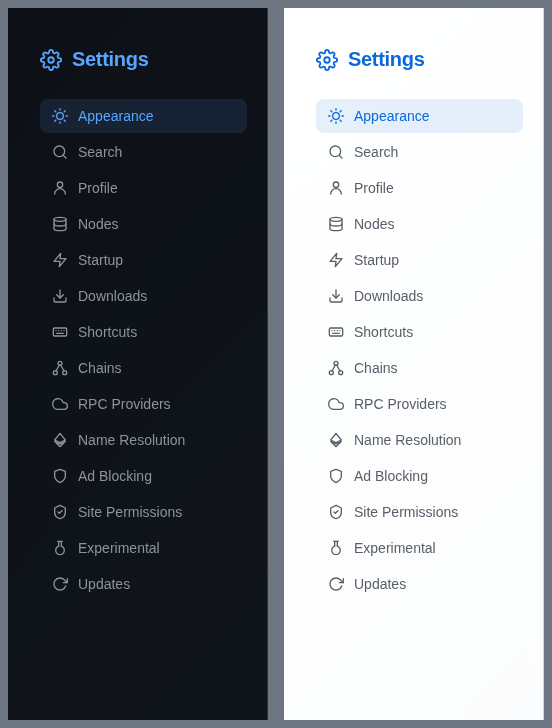

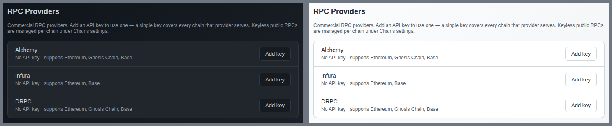

### 2. The same four sources, two vocabularies — [#269](https://github.com/solardev-xyz/freedom-browser/issues/269)

Two controllers hold two independent copy tables for the same four network
sources: `METHODS` at `settings.html:3829-3856` (Name Resolution) and
`accessMeta` at `settings.html:3238-3255` (chain detail).

| source    | Name Resolution label | chain-detail label                     | ENS help | chain help |
| --------- | --------------------- | -------------------------------------- | -------- | ---------- |
| `myotis`  | Myotis light client   | Myotis **P2P** light client            | 153 ch   | 61 ch      |
| `colibri` | Colibri               | Colibri **cryptographic verification** | 87 ch    | 54 ch      |
| `quorum`  | RPC quorum            | RPC quorum                             | 111 ch   | 72 ch      |
| `direct`  | Direct RPC            | Direct RPC                             | 108 ch   | 67 ch      |

Two of four labels differ; all four help sentences differ. The controls differ
too — Name Resolution gives each source a toggle, a coloured badge and nested
config rows; the chain detail gives the same four a grey badge and nothing else.
`quorum` is the worst case: three sentences for one fact, two of them one row
apart on the same screen.

Proposed shared table, written to the "less is more" bar:

| source    | label                      | help                                                            |
| --------- | -------------------------- | --------------------------------------------------------------- |
| `myotis`  | Local node                 | _(none — the `Ready`/`Syncing`/`Off` badge carries it)_         |
| `colibri` | Proof check                | A server answers; Freedom checks the proof itself.              |
| `quorum`  | Several servers must agree | _(none — the `2 of 3` badge carries it)_                        |
| `direct`  | One server, unchecked      | Fastest, and the only option with nothing verifying the answer. |

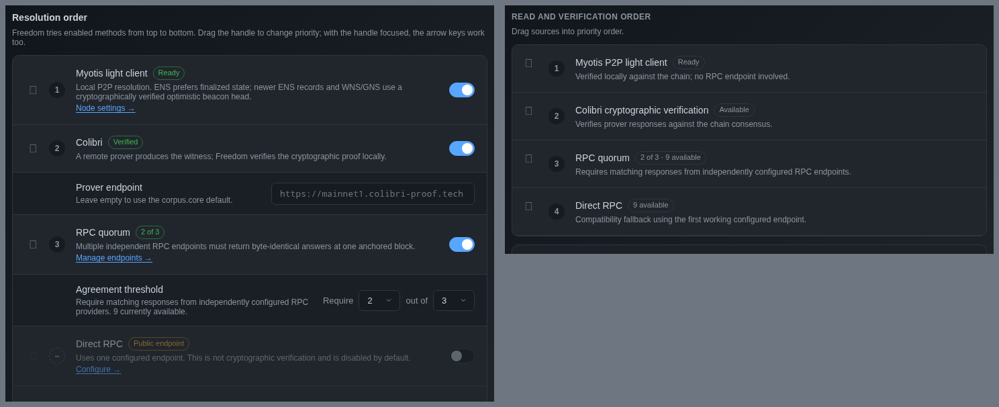

### 3. Jargon in visible labels — [#270](https://github.com/solardev-xyz/freedom-browser/issues/270)

| term                                           | site                                            | proposed                                                       |
| ---------------------------------------------- | ----------------------------------------------- | -------------------------------------------------------------- |
| `optimistic beacon head`, `finalized state`    | `settings.html:3833`                            | delete                                                         |
| `WNS/GNS`                                      | `settings.html:3833`                            | delete — undefined acronyms, one use in any user-facing string |
| `byte-identical answers at one anchored block` | `settings.html:3845`                            | "must give the same answer"                                    |
| `quorum`                                       | `settings.html:3845`, `:3249`                   | "Several servers must agree"                                   |
| `prover` / `Prover endpoint`                   | `settings.html:3964`, `:3341`, `:3062`          | "Proof server", behind Advanced                                |
| `corpus.core default`                          | `settings.html:3965`                            | "Leave empty to use the default."                              |
| `light client`                                 | `settings.html:1331`, `:1329`, `:3832`, `:3240` | "Ethereum node" / "Gnosis node"                                |
| `P2P`                                          | `settings.html:1331`, `:3240`                   | spell out, or delete                                           |
| `RPC`                                          | `settings.html:1040` and ~20 more               | keep inside the Networks detail; "server" in prose             |

`postage` was checked for and does **not** appear in `settings.html` — it lives
in the wallet sidebar's stamp manager, outside this page's scope.

Proposed progressive-disclosure pattern: the plain label is the visible layer;
the technical name and mechanism go behind a per-row `Advanced` disclosure,
collapsed by default.

```
Local node                                    [Ready]   ( ●)
  ▸ Advanced
      Myotis — a peer-to-peer Ethereum light client running inside
      Freedom. ENS lookups use finalized state; newer record types
      use a verified optimistic beacon head.
```

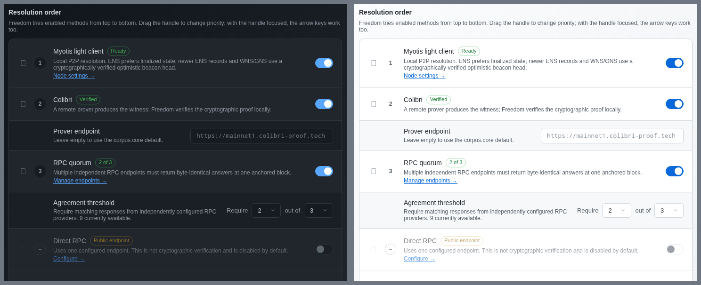

### 4. Nodes is the only section with a Save button — [#271](https://github.com/solardev-xyz/freedom-browser/issues/271)

Every other control on the page commits on change: the theme dropdown, all 20-odd
toggles, the profile name field on blur/Enter (`settings.html:2307-2322`), the
ENS drag order, the quorum dropdowns, the prover endpoint on `focusout`
(`:3538`). Nodes gives each of its four rows a `Save` button (`:2220-2222`).

Read out of the running app on a freshly loaded page with nothing edited:

```
D nodes save buttons: [{"node":"bee","disabled":false},{"node":"ipfs","disabled":false},
                       {"node":"myotis","disabled":false},{"node":"radicle","disabled":false}]
```

All four enabled with no pending change, so the button carries no signal, and the
mode dropdown above it carries no signal that its new value has not taken effect.
Switching Swarm to `Use external node` and navigating away loses the change
silently; every sibling control would have kept it. Chrome has no Save button
anywhere in Settings.

Proposed: auto-save on `change` and drop the four buttons; commit the
external-endpoint text fields on `focusout`, exactly as the Colibri prover
endpoint already does at `:3538`.

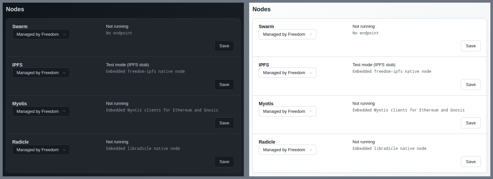

### 5. Site Permissions is 335 characters of prose and no data — [#272](https://github.com/solardev-xyz/freedom-browser/issues/272)

`settings.html:4535-4555` renders an unconditional intro card: 39-character label
plus a **196-character** helper, the longest on the page. `:4560-4564` then
repeats it in 100 more characters. On a fresh profile that is two headings, two
paragraphs, one disabled danger button and zero rows. The intro is not
conditional — it sits above every origin card in the populated state too.

Chrome's equivalent screen has no intro paragraph at all.

Proposed replacement — delete the intro, move `Remove all` next to the section
title, keep one empty state:

```
Site Permissions                                    [ Remove all ]

  No saved permissions
  Sites you allow or block with "Remember for this site" appear here.
```

20-character label, 65-character helper, down from 335. The helper survives the
non-obvious-consequence test because `Remember for this site` is the exact
checkbox string in the prompt, so it tells the user how a row gets created.

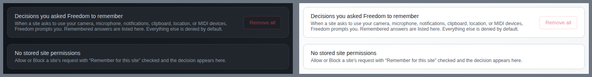

### 6. Helpers that restate the label — [#273](https://github.com/solardev-xyz/freedom-browser/issues/273)

**A. Pure restatement.**

| file:line    | label                     | helper                                                                 | proposed                                                                        |
| ------------ | ------------------------- | ---------------------------------------------------------------------- | ------------------------------------------------------------------------------- |
| `:1238-1239` | `Name` (4)                | `The display name for the current profile.` (41)                       | delete                                                                          |
| `:1299-1302` | `Start Radicle node` (18) | `Starts this profile's embedded Radicle node when Freedom opens.` (63) | delete the default; keep the dynamic replacements at `:1689-1693`, `:1702-1703` |

**B. A shorter label makes the helper unnecessary.**

| file:line    | current                                                                                                  | proposed                                                                                          |
| ------------ | -------------------------------------------------------------------------------------------------------- | ------------------------------------------------------------------------------------------------- |
| `:1313-1318` | `Start Ethereum light client (Myotis)` (36) + 156 ch                                                     | `Start Ethereum node` + `Beta` badge + `Restart to apply.` (17)                                   |
| `:1329-1333` | `Start Gnosis light client (Myotis)` (34) + 119 ch                                                       | `Start Gnosis node` + `Beta` badge + `Restart to apply.` (17)                                     |
| `:1351-1354` | `Ask where to save each file` + `When off, files are saved to your Downloads folder automatically.` (65) | same label + `Otherwise: ~/Downloads` — states the destination instead of restating the off state |

**C. Identical rows disagree on whether they get a helper.** The five Startup rows
are the same kind of row. `Start Swarm node` (`:1277`) and `Start IPFS node`
(`:1288`) have no helper; the other three have 63, 156 and 119 characters. **B**
makes it "all five, in three words".

**D. A paragraph that should shrink or become a link.** `:1559-1562`, Allowlisted
sites, 130 characters. Proposed: `Ad blocking is off on these sites and their
subdomains.` (54); Chrome does not warn about reloads on its own exceptions list.

Roughly 460 characters removed across six rows with no fact lost that the label
or a badge does not already carry.

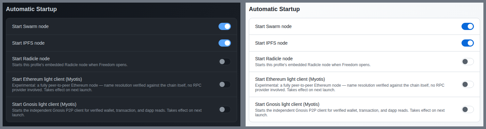

### 7. Ad Blocking: on, inactive, and interactive — [#274](https://github.com/solardev-xyz/freedom-browser/issues/274)

```
E adblock: {"master":true,
            "status":"No filter lists bundled — blocking is inactive.",
            "ads":true,
            "adsDisabled":false}
```

The master toggle reads on, the status says inactive, and all five sub-toggles
are on and interactive. The status text is written into the row's `.row-help`
slot (`settings.html:1467`) — the slot every other row uses for static
explanatory copy — so it does not read as a warning, and nothing about the row's
appearance changes. `.row.disabled` already exists and is used at `:1695` for the
Radicle startup row.

Proposed: disable the master and the five sub-rows when no lists are available,
and state the consequence once — `No filter lists available. Ad blocking cannot
run.`

Separately, four sub-row helpers are filter-list brand names: `EasyList`
(`:1479`), `EasyPrivacy` (`:1491`), `Fanboy Cookiemonster` (`:1503`),
`Fanboy Annoyances` (`:1515`). None says anything the label has not. Proposed:
delete all four and let the attribution footnote at `:1559-1562` carry the list
names — as a link, not the bare parenthesised URL it prints today.

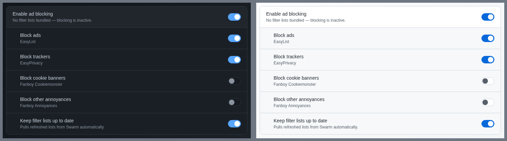

### 8. Experimental is a catch-all — [#275](https://github.com/solardev-xyz/freedom-browser/issues/275)

`settings.html:1565-1626`. Five rows; two are experiments.

| file:line    | row                                       | what it is                                                                       |
| ------------ | ----------------------------------------- | -------------------------------------------------------------------------------- |
| `:1568-1581` | Enable Identity & Wallet _(Beta)_         | an experiment ✓                                                                  |
| `:1582-1592` | Show IPFS load progress in the status bar | an **Appearance** preference                                                     |
| `:1593-1601` | Swarm node mode                           | a status readout + a navigation button; belongs on the Swarm row in **Nodes**    |
| `:1602-1613` | Enable Tor (.onion access) _(Beta)_       | an experiment ✓                                                                  |
| `:1614-1624` | Start Tor when Freedom opens              | the fifth "start X when Freedom opens" toggle; the other four are in **Startup** |

`(Beta)` is inline text at `:1571` and `:1604`
(`<span style="color: var(--text-muted); font-weight: 400">`), while the page
already has a badge component — `.resolver-badge`, used for `Ready` / `Verified`
/ `2 of 3` / `Public endpoint`. Proposed: render `Beta` through it, without
parentheses, so the one marker that means "this may break" looks like a marker.

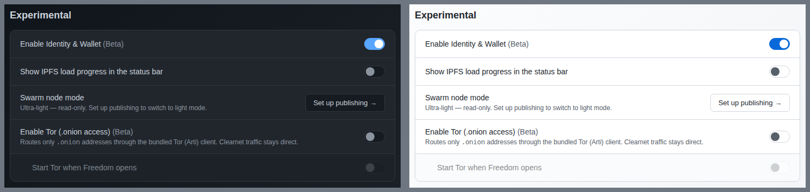

### 9. Section heading ≠ nav label — [#276](https://github.com/solardev-xyz/freedom-browser/issues/276)

Twelve of 14 match exactly. Two do not:

```
F title-vs-nav: [ {"nav":"Startup","title":"Automatic Startup"},
                  {"nav":"Name Resolution","title":"Ethereum Name Resolution"}, … ]
```

`settings.html:969` vs `:1273`, and `:1056` vs `:1401`. Chrome's page title is
always character-identical to the nav entry that reached it; that identity is
what confirms the click did what you meant.

Proposed: change the headings, not the nav labels (the labels have to fit a
260 px column). `Automatic Startup` → `Startup`; `Ethereum Name Resolution` →
`Name Resolution`. The dropped word is already carried in each case — "Automatic"
by every row beginning `Start …`, "Ethereum" by the intro line at `:1406`.

Evidence: `images/settings-06-startup.png` (the heading reads
`Automatic Startup` while the active nav item reads `Startup`).

### 10. Shortcuts is the only Title Case section — [#277](https://github.com/solardev-xyz/freedom-browser/issues/277)

Every row label on the page is sentence case — `Ask where to save each file`,
`Block cookie banners`, `Prefer verified answers`, `When only an unverified
answer is available` — except Shortcuts, whose 23 labels are all Title Case:
`New Tab`, `Close Tab`, `Reopen Closed Tab`, `Move Tab Right`, `Force Reload This
Page`, `Toggle Bookmarks Bar`, `App Developer Tools`, …

Source: the `description` field of each `src/shared/shortcuts.js` entry (`:38`,
`:46`, `:58`, `:66`, `:75`, `:87`, `:95`, `:105`, `:113`, `:121`, …).

The complication is that the same strings are the application-menu labels, where
Title Case is the macOS convention — so this cannot be fixed by lower-casing
`shortcuts.js` in place. Proposed: add `settingsLabel` alongside `description`,
render `settingsLabel ?? description` in the Shortcuts controller, and leave the
menu builder, `docs/features.md`'s shortcut table and #188's docs↔registry guard
tracking `description` untouched.

Note on the group headers, **retracted after this branch rebased onto #263**: an
earlier draft of this finding proposed dropping
`.shortcut-category { text-transform: uppercase }` on the grounds that `TABS` /
`PAGE` / `WINDOW` were the only all-caps text in Settings. That is no longer
true and the proposal is withdrawn. #263 added `.subsection-title`
(`settings.html:159-175`) — a byte-identical 12 px uppercase style — as the
house sub-heading for the chain-detail route, with a comment stating that
`.shortcut-category` is deliberately the same rule. Uppercase is now the
established convention for this heading level, so Shortcuts' headers are
correct as they stand and only the 23 **row labels** are in scope here. The
remaining inconsistency is that Name Resolution did not get `.subsection-title`
— finding 15.

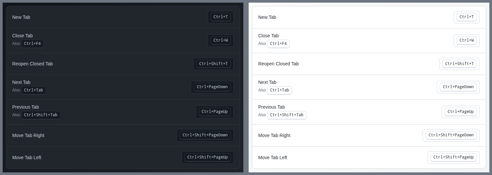

### 11. `+` and `→` baked into button labels — [#278](https://github.com/solardev-xyz/freedom-browser/issues/278)

Three add buttons prefix a literal `+`; four do not. Two navigation buttons
suffix a literal `→`; one does not. All are the same `.btn`.

| file:line    | label                   | glyph |
| ------------ | ----------------------- | ----- |
| `:1196-1198` | `+ Add a search engine` | `+`   |
| `:3065`      | `+ Add a chain`         | `+`   |
| `:3382`      | `+ Add a custom RPC`    | `+`   |
| `:1554`      | `Add`                   | —     |
| `:3135`      | `Add chain`             | —     |
| `:3227`      | `Add endpoint`          | —     |
| `:4393`      | `Add key`               | —     |
| `:1254-1256` | `Manage all profiles →` | `→`   |
| `:2578`      | `Set up publishing →`   | `→`   |
| `:3199`      | `Manage keys`           | —     |

The same split runs through the ENS link labels (`Node settings →` `:3853`,
`Manage endpoints →` `:3847`, `Configure →` `:3854`). Because the glyph is text
content it is also part of the accessible name — "plus Add a chain", "Manage all
profiles right arrow". The chain list rows have the same problem: each announces
as `Ethereum chain 1 ›`, because the chevron at `:3035` is a text node inside the
`<button>`.

Proposed: delete every `+` and `→` from label text (Chrome uses neither on any
Settings button); if a leading `+` is wanted as an affordance, make it an
`aria-hidden` `<svg>` on all seven add buttons rather than three; and mark the
chain-row chevron `aria-hidden="true"`.

Verbs are otherwise already consistent and imperative — `Add` / `Edit` /
`Remove` / `Save` / `Cancel` / `Test` / `Restore defaults`.

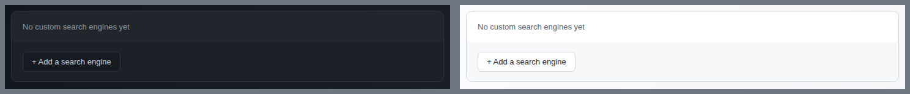

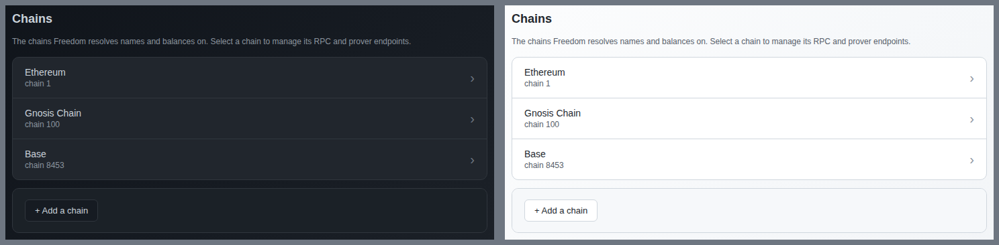

### 12. Two adjacent shields in the nav — [#279](https://github.com/solardev-xyz/freedom-browser/issues/279)

`Ad Blocking` (`settings.html:1058-1072`) and `Site Permissions` (`:1073-1087`)
are neighbours and both use a shield. Measured `getBBox()` in the running app:

```
{"label":"Ad Blocking",      "viewBox":"0 0 24 24","px":"16x16","stroke":"2","ink":"4 2 16 20"}
{"label":"Site Permissions", "viewBox":"0 0 24 24","px":"16x16","stroke":"2","ink":"4 2 16 20"}
```

Identical ink box; at 16 px the only difference is a small check mark. They are
not even the same shield — Ad Blocking uses Feather's `shield` path (`:1069`),
Site Permissions a hand-written path with a flat top and squared shoulders
(`:1084`), visible at 3× below.

Proposed: #268 merges both into one **Privacy and security** entry and the
collision disappears. Failing that, keep the shield for Site Permissions and give
Ad Blocking Feather `slash` or `octagon`. Separately, `Nodes` (`:939-955`) uses
Feather `database` — a storage icon — for four long-running network processes;
`server` or `cpu` matches the concept.

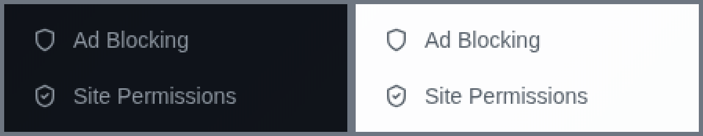

### 13. Bad deep links keep the bad URL — [#280](https://github.com/solardev-xyz/freedom-browser/issues/280)

```
B unknown-section hash: #privacy
B unknown-section active nav: Appearance

A unknown-chain hash: #chains/9999
A unknown-chain heading: Chains
A unknown-chain status: ""
```

The address bar reads `freedom://settings/privacy` while the page shows
Appearance. Bookmark, share or reload it and you get Appearance under a URL
promising a section that has never existed.

Cause: the URL is normalised exactly once, on first load
(`settings.html:2035-2046`). The `hashchange` listener two lines above
(`:2031-2033`) calls `showSection(resolveSection(location.hash))` and never
re-runs that check, so every in-session navigation to a bad hash keeps it. The
chain case is the same shape: `renderList()` runs whenever `config.networks[cid]`
is missing (`:3415-3417`), so `#chains/9999` shows the list under a URL claiming
a detail, with an empty status line.

Proposed: extract the canonicalisation at `:2041-2045` into a function and call
it from the `hashchange` handler too; and in the chains controller's `render()`
(`:3410-3418`), `replaceState` back to `#chains` and set the status to
`That chain is no longer configured.` when `cid` is unknown. Chrome does the
equivalent — `chrome://settings/nonsense` rewrites to the settings root.

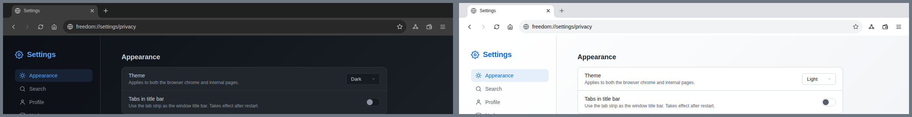

### 14. No search within Settings — [#281](https://github.com/solardev-xyz/freedom-browser/issues/281)

```
C search inputs on page: ["Search shortcuts…"]
```

One search field on the whole page, and it filters the Shortcuts list only
(`#shortcut-search`, `settings.html:1374-1380`). Chrome's Settings has had a
persistent **Search settings** field since 2016; on a 14-section page it is how
most people navigate. Freedom's page is the harder case — Tor's startup toggle is
under Experimental, a chain's API keys are under RPC Providers — so
"I know the word, I don't know the section" is the normal state. A search box in
one section and none for the page also sets the wrong expectation: the user who
finds the Shortcuts field concludes Settings has no search.

Proposed: a `Search settings` input in the `<aside>` header under the `Settings`
`<h2>` (`:873-882`), above the `<nav>`. Smallest useful version filters the 14
`.nav-item` labels; the version worth building indexes every `.row-label` /
`.row-help` plus the `METHODS`/`accessMeta` copy tables and shows a flat result
list with each row's section, as Chrome does. Placeholder `Search settings…`
**with** the ellipsis: every search placeholder in the app already uses one —
`Search shortcuts…` (`:1378`), `Search chains by name or ID…` (`:3103`),
`Search history…` (`history.html:489`), `Search downloads…`
(`downloads.html:397`), `Search origins…` (`index.html:3858`),
`Search site, address, or tx hash…` (`payments.html:394`) — so `…` is the house
style #257 settled on, not a deviation.

Evidence: `images/settings-01-nav.png` — the nav header has no field.

---

## Keep as is

Checked and already at the bar, so a reviewer can confirm this pass looked:

- **Nav icons are one family in the ways that are measurable.** All 14 are
  `16x16` in a `0 0 24 24` viewBox with `stroke-width="2"`, `fill="none"`,
  `stroke="currentColor"`, and all inherit one colour token
  (`rgb(139,148,158)` inactive, `rgb(88,166,255)` active). Stroke weight,
  nominal size and colour are uniform across the set; only the two shields in
  finding 12 are a problem, and that is semantics, not drawing.
- **Sections scroll back to the top on navigation.** `showSection` calls
  `window.scrollTo({ top: 0 })` (`settings.html:2017`) with a comment
  explaining why, so switching from Shortcuts to Downloads does not strand the
  user mid-page. Measured `scrollHeight` against a 712 px viewport: Shortcuts
  2087, `chains/1` 2071, Name Resolution 1023, every other target 712 (no
  scroll at all). No back-to-top control is needed for section switching, and
  the two long targets are a single scroll — short of where a back-to-top
  earns its place.
- **The active section is in the URL.** `freedom://settings/<section>` is
  reflected in the address bar and `#chains/1` survives a reload
  (`resolveSection` splits on `/`, `:2001-2004`). This is better than Chrome's
  behaviour for sub-routes, and it is what makes finding 13 worth fixing rather
  than the feature worth removing.
- **Control types are used consistently for the kind of choice.** Every boolean
  is a toggle (~20 of them); every enumerated choice is a `<select>` (theme
  light/dark/system, search engine, node mode managed/external/disabled,
  unverified-answer ask/open, the quorum `m`/`k` numbers); every action is a
  button. Nothing renders a boolean as a dropdown or an enum as a pair of
  toggles anywhere on the page.
- **Row labels outside Shortcuts are sentence case throughout**, and button
  verbs are imperative throughout — `Add`, `Edit`, `Remove`, `Save`, `Cancel`,
  `Test`, `Restore defaults`. Finding 11 is about glyphs, not verbs.
- **Every list section has an empty state.** Search
  (`No custom search engines yet`, `:1845`), Site Permissions
  (`No stored site permissions`, `:4561`), RPC Providers
  (`No keyed providers available`, `:4408`), chain detail
  (`No custom RPCs yet`, `:3381`), chain search (`No chains found`, `:3077`).
- **`Remove all` is correctly disabled when there is nothing to remove**
  (`:4548-4550`) — the one danger action on the page that can be a no-op, and it
  guards itself.
- **Both themes are complete on this page.** All 15 targets were captured in
  dark and light; there is no unstyled section, no dark-only card and no
  hard-coded literal without a light counterpart — the class of bug #223 and
  #224 fixed has not regressed here.
- **Sub-rows use one nesting convention.** `.row.sub` is the only indentation
  mechanism on the page, used seven times — the four Ad Blocking category rows
  (`:1476`, `:1488`, `:1500`, `:1512`), the auto-update row (`:1524`), the Tor
  startup row (`:1614`) and the per-permission rows under each origin card
  (`:4574`) — and it renders identically in all seven.

## Dependencies on excluded issues

Issues #223–#261 were out of scope and are not re-reported. Two of them moved
while this report was in review, which changed what is left to say about both:

- **[#255](https://github.com/solardev-xyz/freedom-browser/issues/255)** — now
  **closed**, fixed by #263 after this branch was cut. The chain-detail route
  renders one `h2.section-title` again (verified on the merged tree:
  `G chain-detail section-titles: ["H2:Ethereum"]`), and #263 added
  `.subsection-title` at `settings.html:159-175` as the house sub-heading style.
  The fix landed on the chains route only, so Name Resolution is still on the
  old treatment — that remainder is finding 15 below, filed fresh rather than
  reopened, since #255's stated scope is satisfied.
- **[#259](https://github.com/solardev-xyz/freedom-browser/issues/259)** — now
  **closed**, also by #263, which settled _how_ a destructive button looks
  (outlined `--danger`, never filled) and added
  `src/renderer/styles/destructive-buttons.test.js` to guard it repo-wide. It did
  not settle _which_ actions get the treatment, and Settings splits seven
  destructive actions three/four with no rule — finding 16 below.

Nothing else in #223–#261 is load-bearing for any proposal here.

## Findings added after the rebase onto #263

Both were discovered by re-verifying this report against `main` after #263
landed, not by the original pass. Both are new gaps rather than regressions.

### 15. Name Resolution kept the old sub-heading treatment — [#283](https://github.com/solardev-xyz/freedom-browser/issues/283)

#263 moved the chain detail to `h3.subsection-title` (`settings.html:159-175`,
a 12 px uppercase style). Name Resolution has the same shape — one page title,
two sub-sections — and still renders them as `h3.row-label` with hand-written
inline margins:

```html
<h3 class="row-label" style="margin: 0 0 8px 0">Resolution order</h3>
<!-- :1409 -->
<h3 class="row-label" style="margin: 22px 0 8px 0">Safety</h3>
<!-- :1434 -->
```

Read out of the merged tree at `28f68db0`:

```
G chain-detail section-titles: ["H2:Ethereum"]
H ens headings: ["H2.section-title:Ethereum Name Resolution",
                 "H3.row-label:Resolution order",
                 "H3.row-label:Safety"]
```

The finding-2 screenshot shows both in one frame: `Resolution order` on the left
is sentence-case body text indistinguishable from a `.row-label`;
`READ AND VERIFICATION ORDER` on the right is the new uppercase style. Moving
between the two is a normal path — Name Resolution's own rows link to
`#chains/1`.

Using `.row-label` as a heading is also why these two need inline `margin`
overrides at all: it is a _row_ style, so its spacing must be corrected by hand
at each call site.

Proposed: swap `class="row-label" style="margin: …"` for
`class="subsection-title"` at `:1409` and `:1434` and drop the inline margins —
`.subsection-title` already carries `margin: 20px 0 8px 0`. One line each.

Not proposed: merging `.subsection-title` (`:159`) with the byte-identical
`.shortcut-category` (`:738`). The comment at `:159-165` records that the
duplication is deliberate because `settings-styles.test.js` pins the latter by
prelude (#223); noted here only so it is not "cleaned up" later.


### 16. Three of seven destructive actions use `.btn.danger` — [#284](https://github.com/solardev-xyz/freedom-browser/issues/284)

| file:line | action                               | class        |
| --------- | ------------------------------------ | ------------ |
| `:1840`   | Remove a custom search engine        | `btn danger` |
| `:2484`   | Remove an ad-blocking allowlist host | `btn danger` |
| `:4548`   | Remove all site permissions          | `btn danger` |
| `:3207`   | Delete an RPC endpoint (`✕`)         | `btn`        |
| `:3407`   | Remove this chain                    | `btn`        |
| `:4582`   | Remove one site permission           | `btn`        |
| `:4596`   | Remove site (all its permissions)    | `btn`        |

The split does not track severity and is visible inside one card: on Site
Permissions, `Remove all` is red-outlined while `Remove site` and the
per-permission `Remove` directly beneath it are plain — so the two buttons that
destroy a specific stored decision look like ordinary secondary actions, and the
one that is disabled most of the time is the one painted red. Discarding a whole
configured chain (`:3407`, which takes its custom endpoints with it) is plain;
removing one allowlist host (`:2484`) is danger.

Proposed rule, consistent with #263 and with Chrome, which reserves red for
actions that discard data:

- **Danger (outlined `--danger`)** — discards stored data, not undoable from the
  same screen: `:4548`, `:4596`, `:3407`, `:1840`.
- **Plain `btn`** — single-row removals one click from being re-added in the same
  view: `:4582`, `:2484`, `:3207`.

Either mapping is defensible; the point is that one should exist. Under either,
four of the seven are currently wrong.

Two smaller things in the same set: `:3207` is the only destructive control
rendered as a bare `✕` rather than the word `Remove` its six siblings use (it
does carry `title` and `aria-label`, so it is reachable), and `Remove all`
(`:4548`) is the only one with a `disabled` guard — correct, and the only one
that can currently render with nothing to act on.


