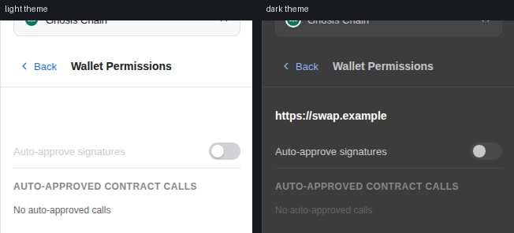
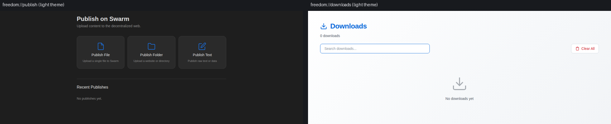
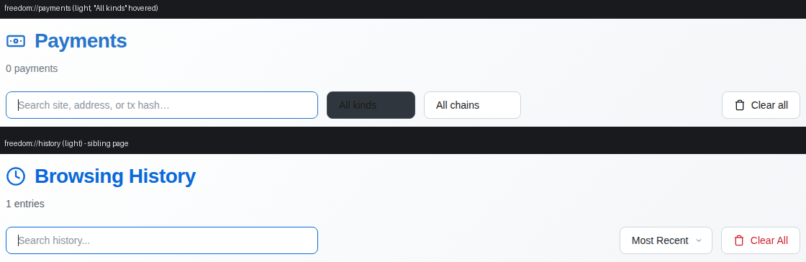
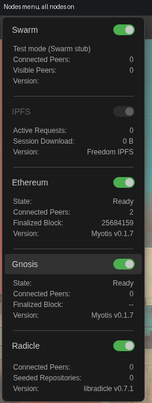
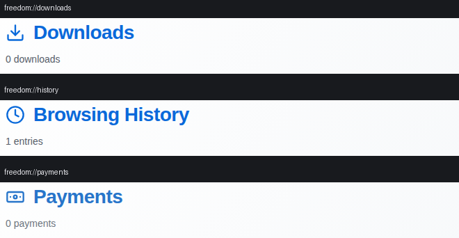
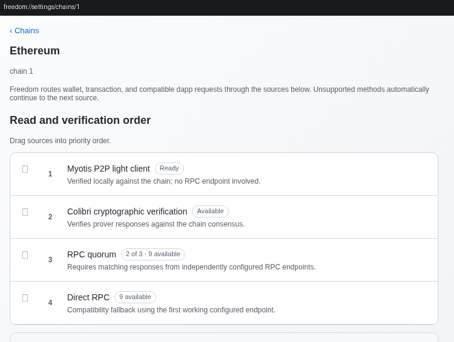
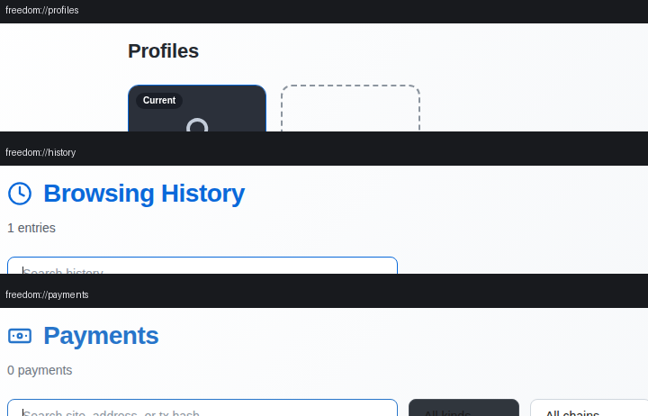
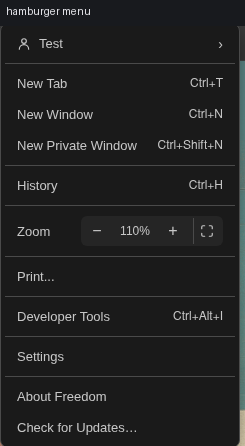
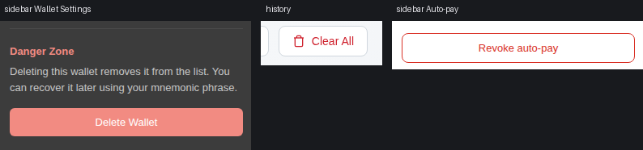
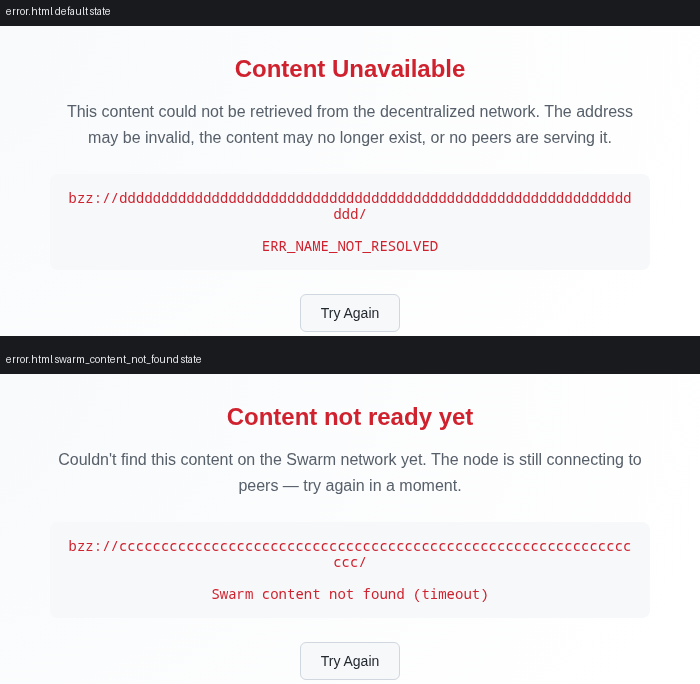

# UI consistency audit — 2026-09

Scope: a hunt-only pass over the Freedom renderer (`src/renderer/**`) looking for
surfaces that disagree with their nearest sibling. Nothing is fixed here; every
confirmed inconsistency has its own issue, linked below.

Method, tooling and conventions:

- Driver: `.claude/skills/run-freedom/` (`tour.js both`, `recipes.js`, plus ad-hoc
  scripts for the surfaces the tour does not reach).
- Conventions checked against `docs/agent-playbooks/ui-consistency.md`.
- Base commit: `18a7e39b` (`main`). App run headless under
  `xvfb-run -a -s "-screen 0 1440x900x24"` with `FREEDOM_TEST_MODE=1`.

## What was exercised

`tour.js both` (48 surfaces × 2 themes: landing, Nodes menu, hamburger menu,
find bar + no-match, permission prompt + indicator popover, download shelf, tab
context menu, pinned/muted tabs, sidebar default, Send form/review/pending/
success, dApp tx/sign/connect, four Swarm approval screens, onchain app + trust
popover, two Tezos interstitials, Swarm error page, all 14 settings sections,
shortcut-conflict banner, Downloads/History/Profiles/Payments, private window +
private sidebar).

Beyond the tour, in both themes: bookmarks bar, add-bookmark modal (+ focused
input), address-bar autocomplete, zoom readout in toolbar and menu, IPFS and
`web3://` error routes, the `freedom://publish` / `links` / `payments` /
`home` pages, the Radicle repository browser (`rad:` route), the onboarding
modal and its create-identity step, sidebar Receive / Wallet Settings / Stamp
manager / Chequebook deposit / Publish setup, the three "manage permissions"
sub-screens and the publisher-identities screen, the private start page, the
profiles manager in catalog mode (`FREEDOM_DEV_HOME`, per
`test-e2e/profiles-fixtures.js`), settings sub-routes `chains`, `chains/1`,
`chains/100` and `rpc`, and window sizes 1000×700 and 1600×1000.

Static passes: every hex/rgb/hsl literal under `src/renderer/**` checked for a
matching light override, and every user-facing string clustered by the action it
names.

## Notes on method

Colour claims in this report were confirmed by sampling the rendered pixels or by
reading `getComputedStyle` inside the running app, not by eyeballing screenshots
— a downsampled screenshot misreads menu backgrounds. Where a finding is a
contrast claim, the computed colour pair is quoted.

## Confirmed inconsistencies

Ranked by user impact. All are pre-existing on `main` at `18a7e39b`; none is a
regression introduced by a specific recent PR unless stated. Issues #223–#242
(the 0.8.5 audit) were excluded from this pass.

| #   | Issue      | Surface                                  | Impact                                                                          |
| --- | ---------- | ---------------------------------------- | ------------------------------------------------------------------------------- |
| 1   | [#ISSUE1]  | Sidebar → manage permissions             | Site origin renders white-on-white in light theme                               |
| 2   | [#ISSUE2]  | `freedom://publish`                      | Only routable internal page with no light theme                                 |
| 3   | [#ISSUE3]  | `freedom://payments`                     | Filter dropdowns lose their chevron and go dark-on-dark on hover in light theme |
| 4   | [#ISSUE4]  | Nodes menu                               | `Finalized Block: --` where every sibling counter shows `0`                     |
| 5   | [#ISSUE5]  | Nodes menu                               | Four different `Version:` placeholder conventions in one menu                   |
| 6   | [#ISSUE6]  | Downloads / History / Payments           | Three counter conventions; `1 downloads` and `1 entries` never pluralise        |
| 7   | [#ISSUE7]  | `freedom://settings/chains/<id>`         | Page title and its sub-sections share `h2.section-title`                        |
| 8   | [#ISSUE8]  | Internal page headers                    | `profiles` and `payments` break the shared page-header pattern                  |
| 9   | [#ISSUE9]  | Hamburger menu + search placeholders     | `...` and `…` mixed in the same menu                                            |
| 10  | [#ISSUE10] | Downloads / History / Payments / Publish | Empty-state punctuation and `Clear All` vs `Clear all`                          |
| 11  | [#ISSUE11] | Sidebar Wallet Settings                  | `Delete Wallet` is a filled destructive button; every sibling is outlined       |
| 12  | [#ISSUE12] | `pages/error.html`                       | Same `<h1>` is Title Case in one state and sentence case in two others          |

---

### 1. Sidebar "manage permissions" screens are unreadable in light theme — [#ISSUE1]

`src/renderer/styles/sidebar.css:3050` — `.perms-site { color: var(--text-primary, #fff); }`

`--text-primary`, `--text-secondary`, `--text-tertiary` and `--bg-elevated` are
never defined anywhere in the chrome (`variables.css` defines `--bg`, `--toolbar`,
`--border`, `--text`, `--accent`, `--muted`, `--modal-bg`, `--menu-bg`, `--danger`,
`--secure-fg`, `--warning-fg` and nothing else), so the dark literal fallbacks
always win in both themes. The light sidebar background is `--toolbar: #ffffff`.

Measured with `getComputedStyle` in the running app, light theme:

| element                 | rule               | computed           | on                 | contrast |
| ----------------------- | ------------------ | ------------------ | ------------------ | -------- |
| `.perms-site`           | `sidebar.css:3050` | `rgb(255,255,255)` | `rgb(255,255,255)` | 1.0 : 1  |
| `.perms-label`          | `sidebar.css:3078` | `rgb(204,204,204)` | `rgb(255,255,255)` | 1.6 : 1  |
| `.perms-section-header` | `sidebar.css:3062` | `rgb(136,136,136)` | `rgb(255,255,255)` | 3.5 : 1  |

The affected rows are the site origin on **Wallet Permissions**
(`index.html:3829`), **Swarm Permissions** (`index.html:3890`) and **Auto-pay**
(`index.html:3865`), plus the auto-approve toggle labels. Same cause at
`sidebar.css:3062, 3089, 3100, 3115, 3120, 3130, 3167, 3203` and at
`lib/wallet/rpc-settings.js:15`. There is no `[data-theme='light'] .perms-*` rule
anywhere. `index.html:1578` has the same class of bug inline
(`var(--border-color, #3a3a3c)` — `--border-color` is also undefined, so the
Radicle alias input keeps a `#3a3a3c` border on the white sidebar).

Repro: light theme → open the wallet sidebar → a connected site → _Manage
permissions_. The origin line is blank.

Suggested fix: replace the undefined tokens with the real ones
(`--text`/`--muted`) or define them in `variables.css` with a
`[data-theme='light']` block.

### 2. `freedom://publish` has no light theme at all — [#ISSUE2]

`src/renderer/pages/styles/publish.css:1-11` hard-codes a dark palette
(`--bg: #1e1e1e; --surface: #2a2a2a; --text: #e0e0e0`) and the file contains no
`@media (prefers-color-scheme: light)` and no `[data-theme='light']` block. Every
other routable internal page has one (`home.html:94`, `error.html:71`,
`history.html:351`, `links.html:163`, `downloads.html:264`, `payments.html:307`,
`profiles.html:516`, `settings.html:782`), as do the sibling page stylesheets
`pages/styles/interstitial.css:136` and `pages/styles/rad-browser.css:740`.
`pages/private.html` is dark-only on purpose and says so in a comment; publish
has no such note.

Sampled pixels, same window, same run, light theme: `freedom://publish` body is
`rgb(30,30,30)`, `freedom://downloads` body is `rgb(245,247,249)`.

Suggested fix: add a `@media (prefers-color-scheme: light)` block to
`publish.css` overriding the five `:root` values, matching `downloads.html`.

### 3. Payments filter dropdowns lose their chevron and invert on hover in light theme — [#ISSUE3]

Three separate misses in the same light block:

- `src/renderer/pages/payments.html:314-315` — the light rule uses the
  `background` **shorthand** (`.search-input, .filter-select, .btn { background:
#ffffff; }`), which discards the `url('data:image/svg+xml,…')` chevron the dark
  rule set at `:70-74`. `history.html:431-435` re-declares the `url()` in its
  light `.sort-select`; payments does not, so "All kinds" and "All chains" render
  with no arrow while History's "Most Recent" keeps its own.
- `src/renderer/pages/payments.html:89-92` — `.filter-select:hover { background-color:
#30363d; }` has no light counterpart, so hovering a filter fills it
  `rgb(48,54,58)` under `#1a1a1a` text (measured).
- `src/renderer/pages/payments.html:113-116` — `.btn:hover` likewise; `history.html:378`
  does override its `.btn:hover`.

Suggested fix: repeat the chevron `url()` in the light `.filter-select` rule and
add light `.filter-select:hover` / `.btn:hover` overrides, copying `history.html`.

### 4. Nodes menu still shows `--` for two counters — [#ISSUE4]

`src/renderer/index.html:713` (`myotis-finalized-block`) and `:742`
(`myotis-gnosis-finalized-block`) default to `--`, and Gnosis keeps `--` for as
long as it has not produced a finalized block. Every other counter in the same
menu uses `0`: `bee-peers-count` (`:650`), `bee-network-peers` (`:654`),
`ipfs-active-requests-count` (`:677`), `radicle-peers-count` (`:769`),
`radicle-repos-count` (`:773`).

The playbook rule ("the Nodes menu shows `0` for an empty counter, never `--`")
comes from #227, which fixed exactly this on the Radicle _Seeded Repositories_
row and left the two structurally identical Myotis siblings alone. Pre-existing;
reported here as the missed sibling of a closed issue.

Repro: Nodes menu → enable Gnosis → _Finalized Block_ reads `--` while Radicle's
_Seeded Repositories_ two rows below reads `0`.

Suggested fix: default both `myotis-finalized-block` and
`myotis-gnosis-finalized-block` to `0`, as #227 did for `radicle-repos-count`.

### 5. Four different `Version:` placeholders in one menu — [#ISSUE5]

The same `Version:` row in the Nodes menu has four conventions:

| node              | markup                                                  | rendered when unknown                               |
| ----------------- | ------------------------------------------------------- | --------------------------------------------------- |
| Swarm             | `index.html:659` ``  | empty — the label sits alone                        |
| IPFS              | `index.html:686` `` | empty, then a name with no version (`Freedom IPFS`) |
| Ethereum / Gnosis | `index.html:717`, `:746`                                | the literal string `Myotis`                         |
| Radicle           | `index.html:778`                                        | `--`                                                |

Visible in every Nodes-menu screenshot: with all nodes running, Swarm's
_Version:_ is blank while Ethereum reads `Myotis v0.1.7` and Radicle
`libradicle v0.7.1`.

Suggested fix: pick one placeholder (the playbook's `0`-not-`--` rule implies a
neutral literal, e.g. `Unknown`) and use it for all four rows.

### 6. Three counter conventions across the three list pages — [#ISSUE6]

The `#stats` subtitle on the three sibling list pages:

- `src/renderer/pages/history.html:805` — `` `${allHistory.length} entries` `` → renders
  **`1 entries`**; also never updated by the search box.
- `src/renderer/pages/downloads.html:661-662` — `` `${allDownloads.length} downloads` `` →
  renders **`1 downloads`**.
- `src/renderer/pages/payments.html:540-543` — correctly pluralised, and shows
  `N of M payments` when a filter is active.

Suggested fix: adopt the payments form (pluralise, and show `N of M` while
filtered) on history and downloads.

### 7. Chain-detail settings route stacks equal-weight headings — [#ISSUE7]

`src/renderer/pages/settings.html:3320` renders the page title as
`<h2 class="section-title">` — and so do its own sub-sections at `:3329`
("Read and verification order"), `:3334` ("Transaction broadcast") and the
`section()` helper at `:3309` ("Your RPCs", "Commercial providers"). Up to five
identical 18 px/600 headings (`.section-title`, `settings.html:139`) on one
route, so a sub-section is indistinguishable from the page it is inside. The
playbook is explicit: "`h2.section-title` for the section, `h3.row-label` … for
sub-headings, never a second large heading." Every other settings section has
exactly one `.section-title`.

Secondary drift in the same markup: those sub-headings are sentence case while
every top-level section title is Title Case (`Automatic Startup`,
`Ethereum Name Resolution`, `Site Permissions`, `Ad Blocking`, `RPC Providers`).

Repro: `freedom://settings/chains/1`.

Suggested fix: demote the three sub-headings to the 12 px uppercase category
style already used elsewhere in settings, keeping one `.section-title` per route.

### 8. Two internal pages break the shared page-header pattern — [#ISSUE8]

`history`, `downloads`, `links` all use the same header: `h1 { font-size: 28px;
color: #58a6ff; display: flex; gap: 12px }` with an inline SVG icon and a
`.subtitle` line under it.

- `src/renderer/pages/profiles.html:67` uses `.page-title { font-size: 22px; color:
var(--text) }` (`profiles.html:555`) — six pixels smaller, body-grey instead of
  accent, no icon, no subtitle.
- `src/renderer/pages/payments.html:31` keeps the size and the icon but uses a different
  accent, `#2775ca` (light: `#2775ca` at `:312`) where the siblings use `#58a6ff`
  (light: `#0969da`). Measured on the rendered pages: payments `rgb(39,117,202)`,
  history `rgb(31,105,218)`.

Suggested fix: give `profiles.html` the shared 28 px accent `h1` + icon +
subtitle, and move payments onto the same accent as its siblings.

### 9. `...` and `…` mixed in the same menu — [#ISSUE9]

Inside the hamburger menu: `src/renderer/index.html:980` `Print...`,
`:893` `Create Profile...`, `:896` `Manage Profiles...` — but `:1005`
`Check for Updates…`. The page context menu (`index.html:4222`
`Save Image As…`) and the bookmark context menu (`lib/bookmarks-ui.js:367`
`Edit…`) use the Unicode form.

Same split in search placeholders and loading strings on sibling pages:
`history.html:478` `Search history...` and `downloads.html:386`
`Search downloads...` vs `payments.html:366` `Search site, address, or tx hash…`
and `settings.html:3063` `Search chains by name or ID…`; `history.html:507`
`Loading history...` vs `payments.html:392` `Loading payments…`.

Suggested fix: standardise on U+2026 (`…`) and add a lint rule or test for
`\.\.\.` in user-facing renderer strings.

### 10. Empty-state punctuation and bulk-clear label drift — [#ISSUE10]

Empty states, same page family, same `.empty-state` component:

- no trailing period: `downloads.html:582` `No downloads yet`,
  `history.html:686` `No history yet` — these two are the pattern the playbook
  names.
- trailing period: `payments.html:552` `No payments yet.` /
  `No payments match your filters.`, `publish.html:105` `No publishes yet.`,
  `index.html:3962` `No publisher identities yet.`, `settings.html:1806`
  `No custom search engines yet.`, `settings.html:3338` `No custom RPCs yet.`

Bulk-clear button, same action, three pages: `history.html:501` `Clear All`,
`downloads.html:404` `Clear All`, `payments.html:386` `Clear all`
(`publish.html:102` uses a bare `Clear`).

Suggested fix: drop the trailing periods and use `Clear All` everywhere.

### 11. `Delete Wallet` is the only filled destructive button — [#ISSUE11]

`src/renderer/styles/sidebar.css:4520-4531` gives `.wallet-settings-delete-btn` a
solid `background: var(--danger)` with `color: #fff`. Every other destructive
control follows the playbook's outlined-`--danger` rule: `Clear All`
(`history.html:487`, `.btn.danger`), `Restore defaults` (`settings.html:1343`),
`Remove all` (`settings.html:4508`), `Revoke auto-pay`
(`index.html:3872`, `.perms-disconnect-btn`, `sidebar.css:3139-3148`).

Suggested fix: restyle `.wallet-settings-delete-btn` as an outlined `--danger`
button like `.perms-disconnect-btn`.

### 12. `error.html` mixes Title Case and sentence case in the same `<h1>` — [#ISSUE12]

`src/renderer/pages/error.html:99` ships `Content Unavailable` (Title Case) as the
default title; the script then replaces it with `Couldn't load this page`
(`:237`, sentence case) for non-dweb URLs and `Content not ready yet` (`:247`,
sentence case) for `swarm_content_not_found`. A user who hits two error kinds in
a session sees two heading conventions on the same page. The sibling
interstitials are sentence case throughout (`ens-unverified.html:20`
`Resolution not cross-checked`, `ens-conflict.html` `RPC servers disagreed`).

Repro: navigate to a `bzz://` hash with no content (Title Case) and to a hash the
node cannot find in time (sentence case).

Suggested fix: make `error.html:99` sentence case (`Content unavailable`) to
match the two runtime titles and the interstitials.

## Checked and clean

Recorded so the next audit does not re-walk them:

- Sidebar white-overlay hovers: one gap out of ~100
  (`sidebar.css:4115`, `.connect-ledger-load-more:hover`); everything else has a
  `[data-theme='light']` partner. Too small to file on its own.
- `interstitial.css` and `rad-browser.css` light blocks cover their surfaces bar
  two low-traffic rules (`.group-reason`, `.icon.submodule`).
- `color: #fff` on `var(--accent)` / `var(--danger)` fills throughout
  sidebar/modal/onboarding is correct in both themes.
- `pages/private.html` is dark-only in both themes by design, with a comment
  saying so.
- The Nodes menu dropdown _does_ honour the light theme
  (`light-theme.css:109-113`); it reads dark in a downsampled screenshot but the
  rendered pixels are `#ffffff`.
- Window sizes 1000×700 and 1600×1000: no layout breakage on home, settings,
  history, payments, the Nodes menu or the sidebar.
- Both add-bookmark modal inputs, the address-bar autocomplete rows and the zoom
  readout matched their siblings in both themes.

## Deliberately not re-reported

Issues #223–#242. In particular #233 (internal pages follow the OS colour scheme
rather than the Appearance setting) is why every internal page in the screenshots
above renders light under `xvfb` regardless of the theme seed; #234 (prover
endpoint input width), #237 (focus rings), #238 (sidebar headers), #239 (Swarm
approval buttons), #242 (home artwork) were all re-observed and are unchanged.
