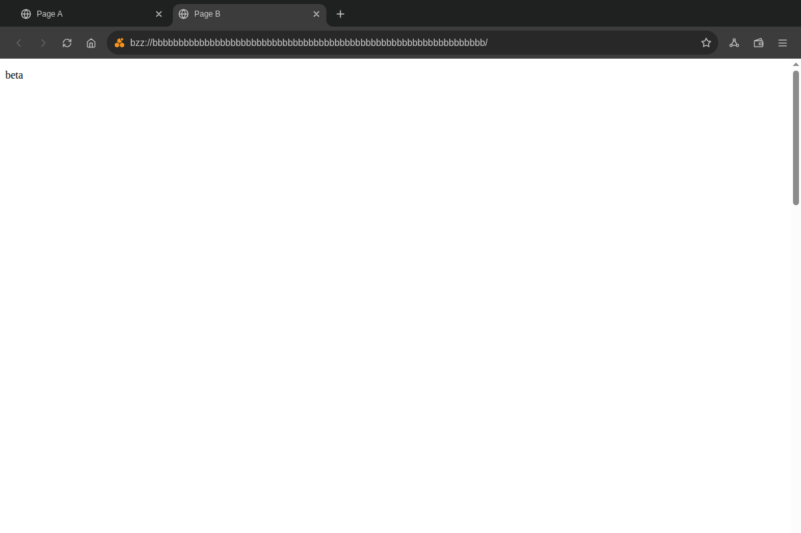
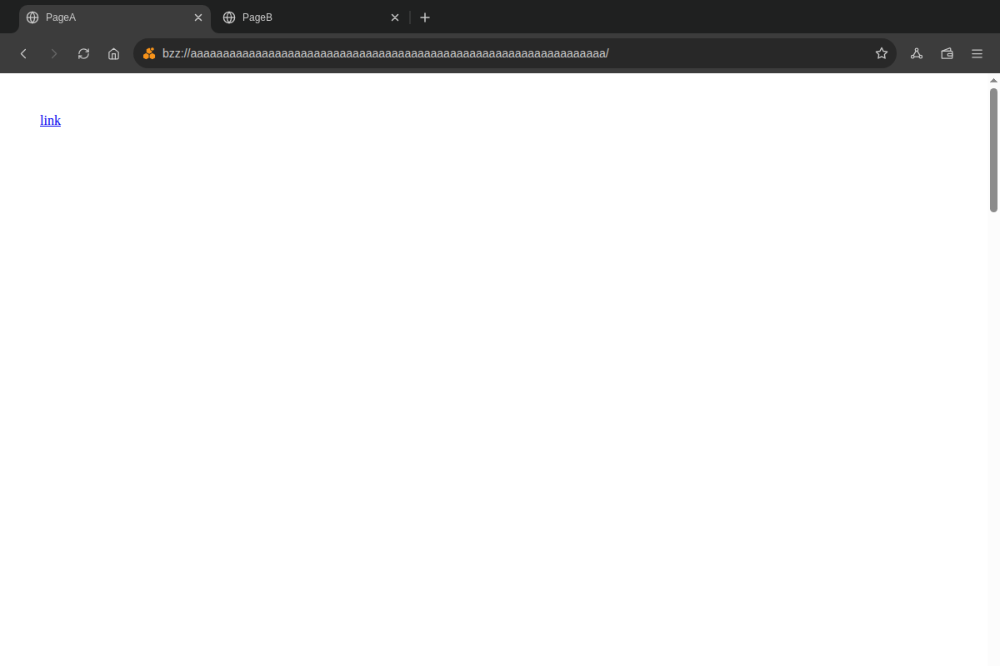
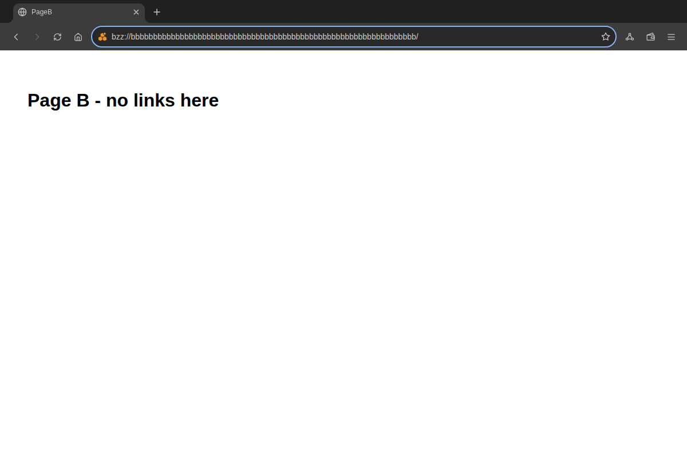
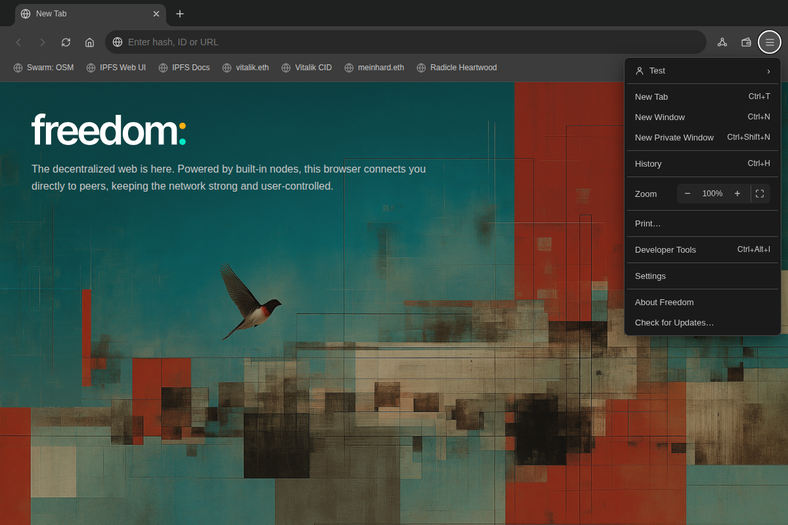
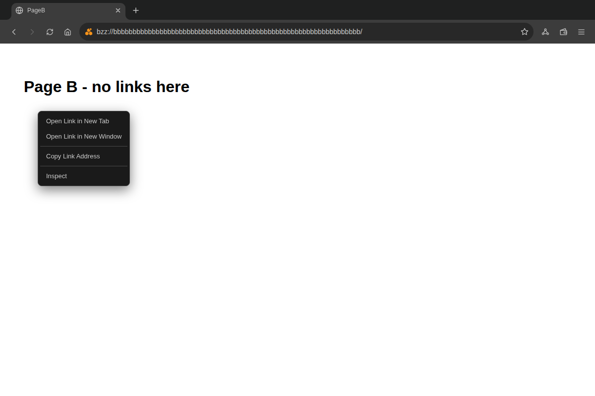
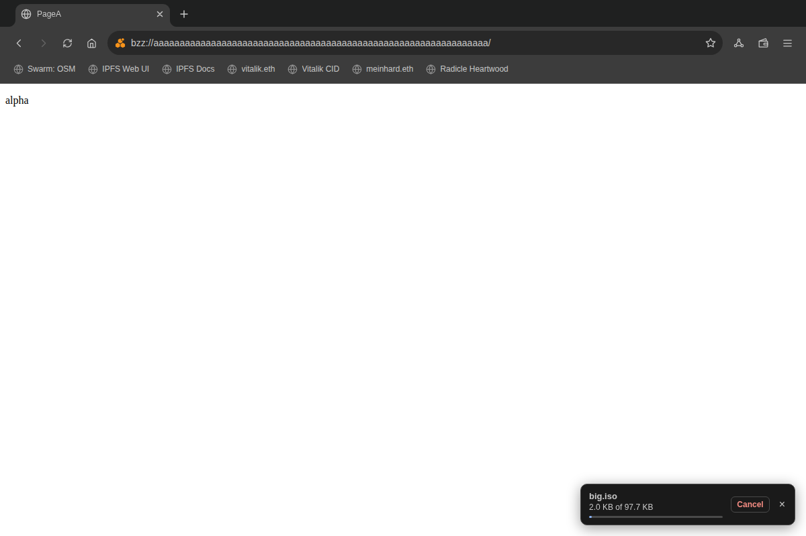
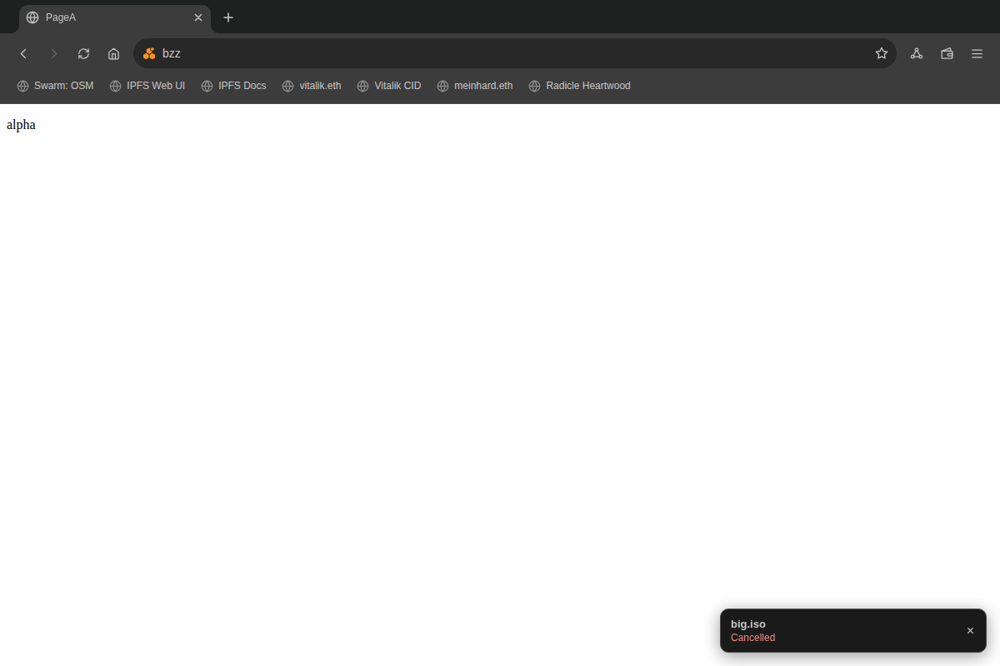
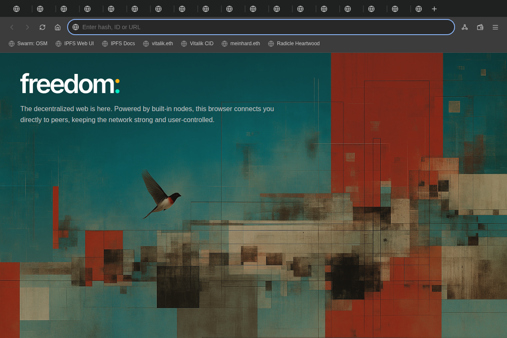
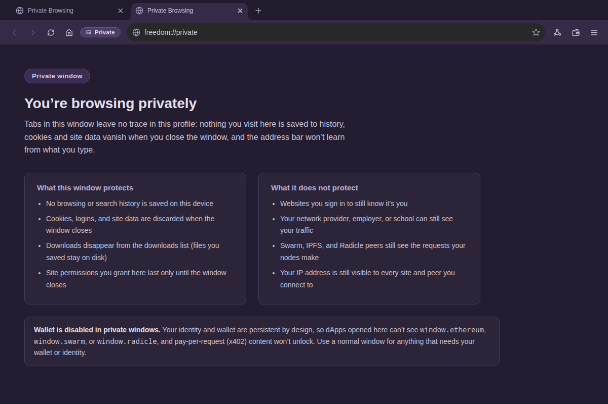

# UI interaction audit — 2026-09

Scope: a hunt-only pass over the Freedom browser chrome looking for **behaviour**
that does not act the way Chrome does — hover, focus, blur, dismissal and timing,
rather than colour or copy. It is the interaction counterpart to
`ui-consistency-2026-09.md`, and it was prompted by the three bugs found in
v0.8.5-rc.4 testing: #299 (the find bar does not track page changes), #300
(highlights survive closing the bar) and #301 (the hamburger profiles flyout
stays open when sibling items are hovered).

Nothing is fixed here. Every confirmed bug has its own issue, linked below.

## Method

- Driver: `.claude/skills/run-freedom/` (`lib.js` + `recipes.js`) under
  `xvfb-run -a -s "-screen 0 1440x900x24"`, Electron launched through
  Playwright's `_electron` with `FREEDOM_TEST_MODE=1` and the in-process test
  harness, per `SKILL.md`.
- Input was driven as **real pointer and keyboard input** (`page.mouse.click`,
  `page.mouse.down({button:'middle'})`, `page.keyboard.press`) at window
  coordinates, not as `element.click()` DOM dispatch, because every bug in scope
  is about hover, focus, blur or timing. Link targets inside a guest were located
  by reading the anchor's rect with `webview.executeJavaScript` and offsetting it
  by the `<webview>`'s own `getBoundingClientRect()`, so the click lands on the
  real link through the real hit-test path.
- Focus claims are stated two ways so they do not depend on the harness routing
  keystrokes into a guest: `document.activeElement` in the chrome document, and
  `document.hasFocus()` read _inside_ each guest.
- Conventions and the "compare with the nearest sibling" rule come from
  `docs/agent-playbooks/ui-consistency.md`.
- Base commit: `584f7e08` (`main`). Window 1200×800 unless a finding says
  otherwise. Dark theme; every finding here is theme-independent (no colour or
  layout-palette claim is made), and the two that touch layout (#311, and the
  420 px resize check below) were re-run at other window sizes instead.

## What was exercised

Against the coverage list, in a normal window and — where applicable — in a
private window:

- **Hamburger menu and Nodes menu**: open, hover between items, hover into and
  out of the profiles flyout, click outside, click into page content, Escape,
  Tab through the items, tab switch while open, window blur.
- **Tab context menu and page context menu**: the same list, plus navigation
  while open (client-side redirect and reload) and clicking a menu item after
  the page underneath changed.
- **Tabs**: middle-click to close, middle-click and Ctrl+click on links,
  Shift+click, drag reorder, pin/unpin, close the last tab, reopen closed tab
  (Ctrl+Shift+T, repeated), tab switch by click and by Ctrl+Tab (scroll
  restoration, focus destination, address-bar contents), new-tab focus, which
  tab is activated after a close, 20 tabs in a 1200 px window.
- **Address bar**: click-to-focus selection, typing, autocomplete open/arrow
  keys/Enter/Tab/Escape, Escape with and without the dropdown open, a page
  committing while the user types, tab switch with a half-typed URL, right-click
  edit menu, paste-and-go.
- **Find bar**: per-tab state, Enter/Shift+Enter, Escape and where focus lands,
  the close button, navigation and tab switch while open, selection and
  right-click in the input.
- **Back/forward and reload while a prompt is open**: reload with a permission
  prompt up (main correctly withdraws it — no bug), back/forward with a context
  menu open (see #308).
- **Download shelf**: dismiss during and after transfer, multiple concurrent
  cards, navigation and tab switch with the shelf up, auto-dismiss.
- **Permission prompt**: Escape, tab switch (correctly re-queued and re-shown),
  navigation away (correctly withdrawn by main), a second request while one is
  open (correctly queued).
- **Zoom**: zoom in/out/reset, a new tab on the same origin (inherits the level
  from Chromium's per-host zoom — no bug), reset.
- **Bookmarks bar**: add, edit, remove, Ctrl+click, middle-click, drag, overflow
  chevron at 420 px.
- **Sidebar**: Escape, closing while a flow is pending, tab order with the panel
  collapsed (Chromium already skips the zero-width panel in sequential focus
  navigation — no bug), chrome shortcuts with focus inside the panel.
- **Private window**: new tab, address bar, menus, tab strip.
- **Window resize**: 420×700 and 1600×1000 (the toolbar and the bookmarks
  overflow degrade cleanly — no bug); `getMinimumSize()` is `[0, 0]`, noted
  under "not reported" below.

## Confirmed bugs

Ranked by user impact. **All are pre-existing on `main` at `584f7e08`; none is a
regression introduced by a specific recent PR.** Issues #223–#242, #249–#260,
#268–#284 and #299–#301 were excluded from this pass.

| #   | Issue                                                              | Surface                | Impact                                                                             |
| --- | ------------------------------------------------------------------ | ---------------------- | ---------------------------------------------------------------------------------- |
| 1   | [#303](https://github.com/solardev-xyz/freedom-browser/issues/303) | Links / tabs           | Ctrl/Cmd+click and middle-click open a **foreground** tab; Shift+click opens a tab |
| 2   | [#304](https://github.com/solardev-xyz/freedom-browser/issues/304) | Tab switch             | The page is never focused; focus stays on the tab button or on the hidden old tab  |
| 3   | [#305](https://github.com/solardev-xyz/freedom-browser/issues/305) | Address bar            | A page commit overwrites what the user is typing                                   |
| 4   | [#306](https://github.com/solardev-xyz/freedom-browser/issues/306) | Hamburger / Nodes menu | Esc does not close them — every other menu in the chrome closes on Esc             |
| 5   | [#307](https://github.com/solardev-xyz/freedom-browser/issues/307) | Bookmarks bar          | Ctrl+click replaces the current page, middle-click does nothing, no drag reorder   |
| 6   | [#308](https://github.com/solardev-xyz/freedom-browser/issues/308) | Page context menu      | Survives a navigation and then acts on the previous page's link                    |
| 7   | [#309](https://github.com/solardev-xyz/freedom-browser/issues/309) | Download shelf         | Dismissing an in-progress card brings it back on the next 250 ms progress tick     |
| 8   | [#310](https://github.com/solardev-xyz/freedom-browser/issues/310) | Address bar            | Esc after arrow-keying into autocomplete leaves the typed fragment in the bar      |
| 9   | [#311](https://github.com/solardev-xyz/freedom-browser/issues/311) | Tab strip              | Tabs past the strip width are clipped and unclickable — including the active one   |
| 10  | [#312](https://github.com/solardev-xyz/freedom-browser/issues/312) | Private window         | New Tab leaves focus nowhere and shows `freedom://private` in the bar              |
| 11  | [#313](https://github.com/solardev-xyz/freedom-browser/issues/313) | Autocomplete           | Arrow keys wrap around instead of returning to the typed text                      |
| 12  | [#314](https://github.com/solardev-xyz/freedom-browser/issues/314) | Address bar            | An unsubmitted edit is discarded on tab switch and back                            |
| 13  | [#315](https://github.com/solardev-xyz/freedom-browser/issues/315) | Tab context menu       | Stays open after a keyboard tab switch and keeps acting on the old tab             |
| 14  | [#316](https://github.com/solardev-xyz/freedom-browser/issues/316) | Find bar               | Right-clicking the input gives no Cut/Copy/Paste menu, unlike the address bar      |

Each issue carries a self-contained harness repro, the Chrome behaviour it should
match, and the `file:line` to change. The summaries below are the short form.

---

### 1. Ctrl/Cmd+click and middle-click open a foreground tab — [#303](https://github.com/solardev-xyz/freedom-browser/issues/303)

`src/main/webcontents-setup.js:144` destructures `setWindowOpenHandler`'s
callback argument as `({ url, frameName })` and drops Chromium's `disposition`
(`background-tab` / `foreground-tab` / `new-window`); `src/main/webview-preload.js:302`
collapses every modifier into one boolean:

```js
const wantsNewTab =
  event.button === 1 ||
  event.metaKey ||
  event.ctrlKey ||
  event.shiftKey ||
  isBlank ||
  isNamedTarget;
```

`createTab` then always calls `switchTab(tabId, { isNewTab: true })`
(`src/renderer/lib/tabs.js:1202`).

Measured, Ctrl+clicking a link on Page A:

```
before : {"n":1,"activeIdx":0,"titles":["Page A"],"focus":"BODY"}
after  : {"n":2,"activeIdx":1,"titles":["Page A","Page B"],"focus":"WEBVIEW.hidden"}
```



Note the second half: focus is left on the `<webview class="hidden">` of the tab
the user was on, so the next keystroke goes to a page that is no longer visible.
That half is finding 2.

### 2. Switching tabs never focuses the page — [#304](https://github.com/solardev-xyz/freedom-browser/issues/304)

`switchTab` (`src/renderer/lib/tabs.js:1475-1528`) toggles `.hidden` on the
webviews and calls `setActiveWebview`, but never calls `tab.webview.focus()`.
The only `webview.focus()` in the renderer is `src/renderer/lib/find-bar.js:234`.

Read from inside each guest:

```
after clicking into page B : {"guests":{"hidden:PageA":true,"active:PageB":true},"chromeActive":"WEBVIEW."}
after clicking tab 1       : {"guests":{"active:PageA":true,"hidden:PageB":true},"chromeActive":"BUTTON.tab active"}
```

Adding `document.querySelector('webview:not(.hidden)').focus()` after the switch
restores `chromeActive: "WEBVIEW."`, which is the acceptance check for a fix.



Scroll position itself is fine: `.hidden` on a webview is `visibility: hidden`
(`src/renderer/styles/base.css:48-49`), not `display: none`, so Chromium keeps
the guest's layout and scroll offset across a switch. Only focus is lost.

### 3. A page commit overwrites the address bar while the user types — [#305](https://github.com/solardev-xyz/freedom-browser/issues/305)

`handleNavigationEvent` (`src/renderer/lib/navigation.js:1813-2013`) writes
`addressInput.value` on every commit with no check of `document.activeElement`
and no "user is editing" flag — `:1858`, `:1894`, `:1917`, `:1939`, `:1954`,
`:1957`, `:1961`, `:1977-1984`. The only guard is the `about:blank` case. `:2012`
then persists the clobbered value into `addressBarSnapshot`, so Escape cannot get
it back either.

Repro used a realistic trigger — a page that redirects itself three seconds after
load, the shape of a login hop or a shortener:

```
while typing       : {"v":"my-important-note.eth/deep/link","f":"address-input"}
after the redirect : {"v":"bzz://bbbb…bbbb/","f":"address-input"}
```



### 4. Esc does not close the hamburger or Nodes menu — [#306](https://github.com/solardev-xyz/freedom-browser/issues/306)

`src/renderer/lib/menus.js` has one `window` `keydown` listener (`:269-281`), but
it only handles the zoom accelerators — nothing in the module handles Escape.
The fix belongs in that existing chain rather than in a second listener.
Dismissal today is a `document` click listener (`:327-339`), the backdrop's
`mousedown` (`src/renderer/lib/menu-backdrop.js:9-13`) and `window` blur
(`:345`). Every sibling surface does handle Escape — tab context menu
`tabs.js:1708-1712`, page context menu `page-context-menu.js:304-308`, bookmark
context menu `bookmarks-ui.js:399`, trust popover `navigation.js:2102-2105`,
permission prompt `site-permissions-ui.js:389-393`, find bar
`find-bar.js:289-294`.

```
hamburger open         : {"menu":true,"backdrop":true}
hamburger after Escape : {"menu":true,"backdrop":true}
nodes open             : {"nodes":true,"backdrop":true}
nodes after Escape     : {"nodes":true,"backdrop":true}
```



It is already a known driving hazard: `SKILL.md`'s Gotchas list it, and
`lib.js:80-92` ships a `closeMenus()` helper that clicks the backdrop instead.
Focus is also neither trapped nor restored to `#menu-button` on dismissal.

### 5. Bookmarks bar ignores Ctrl+click and middle-click — [#307](https://github.com/solardev-xyz/freedom-browser/issues/307)

`handleBookmarkClick` (`src/renderer/lib/bookmarks-ui.js:336-353`) is bound to
plain `click` and always navigates the current tab; there is no `auxclick`
listener and no `metaKey`/`ctrlKey`/`shiftKey` check anywhere in the file, and
`button.draggable` is `false` (the tab strip does have all four DnD handlers,
`tabs.js:943-1009`).

```
bookmark-btn       : {"label":"Swarm: OSM","draggable":false}
after Ctrl+click   : {"tabsBefore":1,"tabsAfter":1,"url":"bzz://ab7720…/"}
after middle-click : {"tabs":1}
```

Ctrl+clicking a bookmark throws away the page the user was reading.

### 6. The page context menu survives a navigation — [#308](https://github.com/solardev-xyz/freedom-browser/issues/308)

Nothing calls `hidePageContextMenu()` (`src/renderer/lib/page-context-menu.js:130-139`)
from a navigation path, and `currentContext` (`:39`) keeps the old page's
`linkUrl`/`pageUrl`. Raising a link menu on Page A, letting Page A redirect to
Page B, then clicking **Open Link in New Tab** opens Page A's link:

```
menu after the redirect : {"vis":true,"url":"bzz://bbbb…"}
tabs after clicking it  : ["PageB","PageC"]
```



The Back/Forward/Reload rows are equally stale — their disabled states are
computed once at `:86-100`.

### 7. Dismissing an in-progress download resurrects the card — [#309](https://github.com/solardev-xyz/freedom-browser/issues/309)

`dismissCard` (`src/renderer/lib/downloads-ui.js:73-79`) records nothing, and
`handleDownloadUpdate` rebuilds unconditionally (`:206-208`). Main emits progress
every 250 ms (`src/main/downloads/downloads-manager.js:66`).

```
after first tick         : ["big.iso 1000 B of 97.7 KB Cancel ×"]
after user dismiss       : []
after next progress tick : ["big.iso 2.0 KB of 97.7 KB Cancel ×"]
```



### 8. Esc after arrow-keying into autocomplete — [#310](https://github.com/solardev-xyz/freedom-browser/issues/310)

Two Escape handlers are bound to `#address-input` and neither stops propagation.
`navigation.js:2148-2167` restores the page URL and blurs; `autocomplete.js:303-310`
runs afterwards (registration order: `index.js:755` then `:760`) and writes the
typed query back. The bar comes to rest showing a fragment that is neither the
page URL nor an active edit.

The trigger is narrower than "autocomplete is open": `autocomplete.js` only sets
`originalQuery` on the _first_ `ArrowDown`/`ArrowUp` into the dropdown
(`:264-266`, `:274-276`), so its Escape branch is a no-op until the user has
arrow-keyed at least once. Type-then-Esc with the dropdown open behaves
correctly — measured on the harness against a page at
`https://example.org/alpha`:

```
typed, dropdown open           : {"v":"exa","focused":"address-input"}
Esc (no arrow keys)            : {"v":"https://example.org/alpha","focused":""}   // correct

typed, then ArrowDown          : {"v":"https://example.org/alpha","focused":"address-input"}
Esc (after ArrowDown)          : {"v":"exa","focused":""}                          // the bug
```

The screenshot below is the same arrow-key path against the original `bzz` repro
— page on screen `bzz://aaaa…aaaa/`, bar left holding `bzz`:



### 9. The tab strip clips tabs with no overflow UI — [#311](https://github.com/solardev-xyz/freedom-browser/issues/311)

`.tabs-container { overflow: hidden }` (`src/renderer/styles/tabs.css:44-55`) plus
`.tab { min-width: 50px }` (`:58-73`), and `switchTab` never scrolls the active
tab into view. 20 tabs in a 1200 px window:

```
{"total":20,"containerW":1010,"fullyVisible":17,"lastTabRight":1137,"containerRight":1020,"widths":[50,50,50],"overflowUI":false}
```



The three clipped tabs — including the active one — are unreachable by mouse;
only `Ctrl+Tab` (`tabs.js:1374`) gets back to them.

### 10. New Tab in a private window leaves focus nowhere — [#312](https://github.com/solardev-xyz/freedom-browser/issues/312)

`navigation.js:2519-2525` focuses the address bar only when the new tab derives
to an empty display, which is true for `homeUrl` but not for the private start
page `freedom://private` (`tabs.js:377-385`).

```
private window, initial : {"active":"BODY#","url":"freedom://private"}
private window, new tab : {"active":"BODY#","url":"freedom://private","tabs":2}
```



A normal window's new tab correctly gives `{"value":"","focused":true}`.

### 11. Autocomplete arrow keys wrap around — [#313](https://github.com/solardev-xyz/freedom-browser/issues/313)

`autocomplete.js:262-280` steps `selectedIndex` modulo the suggestion count, so
there is no "your typed text" row at either end; `originalQuery` is captured but
only reachable via Escape. Hover does not move the highlight either — only
`click` is bound (`:359-361`).

### 12. An unsubmitted address-bar edit is lost on tab switch — [#314](https://github.com/solardev-xyz/freedom-browser/issues/314)

The save side works (`navigation.js:2457-2461`); the restore is gated on the tab
still loading (`navigation-utils.js:548-551`), so an idle tab's draft is
recomputed away. Same missing "user is editing" concept as finding 3 — best fixed
together.

### 13. The tab context menu stays open after a keyboard tab switch — [#315](https://github.com/solardev-xyz/freedom-browser/issues/315)

`switchTab` calls `closeFindBar()` (`tabs.js:1500`) but not `hideTabContextMenu()`
(`:1463-1471`), and `closeTab` (`:1245-1310`) does not either. A mouse tab switch
happens to dismiss it through the `document` click listener (`:1701-1705`); a
Ctrl+Tab does not, and `contextMenuTabId` (`:1416`) is never invalidated.

### 14. The find-bar input has no edit context menu — [#316](https://github.com/solardev-xyz/freedom-browser/issues/316)

`index.js:762` calls `initChromeInputContextMenu()` with no `inputs` argument, so
it falls back to `[document.getElementById('address-input')]`
(`chrome-input-context-menu.js:178-180`). Right-clicking `#find-bar-input` shows
nothing; right-clicking the address bar one row above shows the menu.

## Deliberately not reported

Checked, and either correct or a documented simplification rather than a bug:

- **Permission prompt on tab switch** — correctly re-queued at the head and
  re-shown on return (`site-permissions-ui.js:419-433`), with a deliberate
  `setTimeout(…, 0)` so the switching click cannot hit the click-away path.
  Navigation away and a second concurrent request are both handled (main watches
  the requesting `webContents`, `permissions-manager.js:458-476`), and the module
  deliberately refuses to dismiss on window blur, with the reasoning written down
  at `:395-403`. Reload with a prompt open correctly withdraws it.
- **Zoom on a new tab to the same origin** — inherits the level (measured 1.3 on
  both tabs), because Chromium's host-zoom map is per-origin per-session. It does
  not survive a restart and there is no omnibox zoom chip, but neither is an
  interaction bug and both are better raised as a zoom feature issue than as a
  Chrome-mismatch.
- **Scroll restoration across a tab switch** — preserved, see finding 2.
- **Close the last tab** — closes the window (`tabs.js:1304-1307`, the `else`
  branch of the active-tab check at `:1299`), like Chrome.
- **Reopen closed tab** — LIFO stack up to 20 (`tabs.js:84-85`, `:1245`,
  `:1338-1346`); it restores the URL only, not history/scroll/strip position.
  That is an explicit simplification with a reasoned comment (including the
  private-window case at `:1241-1244`), so it belongs in a feature issue, not a
  behaviour-bug issue.
- **Collapsed sidebar in the tab order** — the panel keeps 179 focusable
  descendants and is neither `inert` nor `aria-hidden`, but a 40-step Tab walk
  from the address bar never enters it: Chromium skips the zero-width,
  `overflow: hidden` subtree in sequential focus navigation. Not reproducible as
  a user-visible bug.
- **Window resize** — at 420×700 the toolbar, tab strip and bookmarks overflow
  chevron all degrade cleanly with no horizontal overflow
  (`scrollWidth === innerWidth`). Worth noting separately: the window has no
  minimum size at all (`getMinimumSize()` → `[0, 0]`), so it can be dragged
  arbitrarily small; that is a `BrowserWindow` option, not an interaction bug.
- **Find bar** — per-tab state, navigation tracking and highlight clearing are
  all #299/#300 and were excluded. The query string persisting in the input
  across a tab switch (`closeFindBar` never clears `findInput.value`) is part of
  #299's "each tab has its own query" model, so it is not re-reported here.
- **Profiles flyout hover** — #301.
- **`#bzz-webview` dead listeners** — `menus.js:199`, `tabs.js:1716`,
  `bookmarks-ui.js:404` and `autocomplete.js:351` all look up an element that no
  longer exists (webviews are created id-less at `tabs.js:437`). Verified
  harmless today: `#menu-backdrop` covers the whole window while any of those
  surfaces is open, so a click into page content still dismisses them
  (`{"menu":false,"backdrop":false}` after a real click at the page centre). Dead
  code, not a behaviour bug — noted inside #306 and #315 for removal alongside
  the real fix.

## Cross-cutting themes

Three of these are one root cause each, and fixing the cause closes several rows:

- **No "the user is editing the address bar" flag.** #305, #314 and part of #310
  all come from `navigation.js` treating `addressInput.value` as a pure function
  of the committed URL.
- **No focus policy for tab activation.** #304 and #312 are the same missing
  step, once for existing tabs and once for new ones; #303's stranded focus is
  the third face of it.
- **Dismissal is wired per surface, not centrally.** `closeAllOverlays` exists
  (`index.js:742`) but only the backdrop calls it; Escape, tab switch and
  navigation each dismiss some surfaces and not others (#306, #308, #315). A
  single "chrome state changed" broadcast would make the matrix uniform instead
  of eight independently-maintained listener sets.
